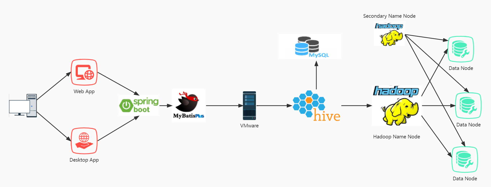
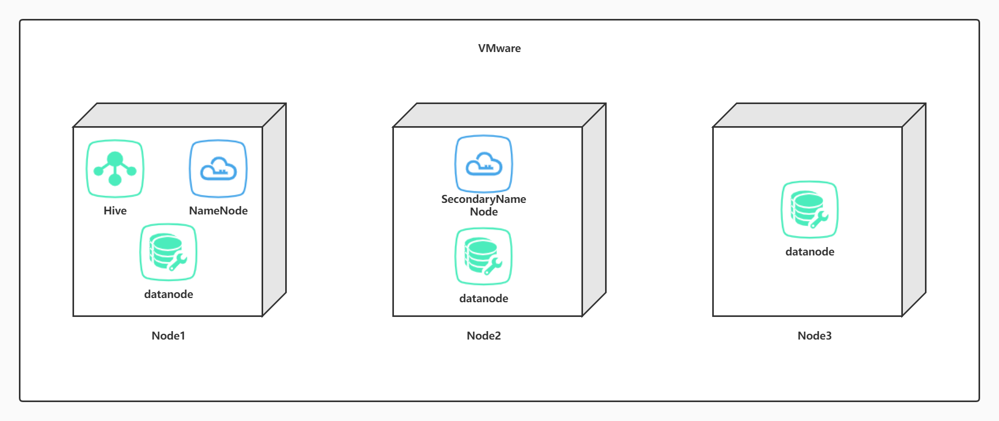
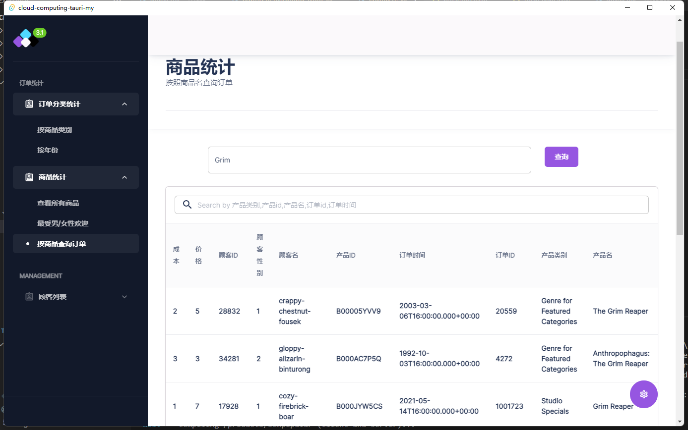

# 2022秋 云计算技术 课程项目

> 学号：1951477
>
> 姓名：孟宇
>
 

---

## 项目简介

​	设计和实现一个由多个节点组成的云服务系统，并提供云系统中的存储服务功能。

1. 通过 Hadoop 平台搭建云系统，有两种架构方式（两者选其一完成即可）。
2.  云系统的节点数量不少于 4 个。 
3.  云系统拥有基本的分布式存储功能，包括: 
   - 文件的上传与下载。
   - 文件的分块与备份。
   - 文件的一致性。
4. 基于搭建好的 Hadoop 安装 Hive，并在 Hive 上创建数据库，然后为一个销售系统的销售模块创建库和表（需自行设计表结构，并构造一些模拟数据填充进去，以便可以用来做查询分析）。

---

## 整体架构

本项目的整体架构图如下

---

### 1. 存储架构

---

#### 表设计

1. 商品表的设计 `product`

| 商品id（p_id） | 产品名称（p_name） | 产品分类（p_category） | 产品成本（cost） | 产品售价（price） |
| -------------- | ------------------ | ---------------------- | ---------------- | ----------------- |
| string         | string             | string                 | int              | int               |

---

1. 顾客表的设计 `customers`

| 顾客id（c_id） | 顾客姓名（c_name） | 顾客性别（c_sex） |
| -------------- | ------------------ | ----------------- |
| int            | string             | string            |

---

3. 订单表的设计 `purchase`

| 订单id（o_id） | 订单时间（o_time） | 商品数（num） | 买家id（c_id） | 买家名字（c_name） | 买家性别（c_sex） | 商品id（p_id） | 商品名称（p_name） | 商品类别（p_category） | 商品成本（cost） | 商品售价（price） |
| -------------- | ------------------ | ------------- | -------------- | ------------------ | ----------------- | -------------- | ------------------ | ---------------------- | ---------------- | ----------------- |
| int            | date               | int           | int            | string             | string            | string         | string             | string                 | int              | int               |

---

#### 模拟数据插入

​	数据表中使用 Python 进行随机的数据插入，数据量级如下：

​		customers 表：20000+

​		product 表： 200000+

​		purchase 表：1000000+

​	模拟数据的生成脚本附带在项目文件中。

---

### 后端

​	后端搭建采用了经典的 Java 语言 Springboot 框架进行快速开发，通过 hive-jdbc 与分布式存储系统通信并进行查询。基于去范式化的数据库设计，查询方面将不会涉及到大量的多表级联聚合统计，因此 ORM 框架方面选择 MyBatis-Plus ，使得单表查询的实现更简单轻便。

---

### 前端

​	前端方面，选择了基于 typescript 和 rust 语言的技术栈，实现了一套同时适配浏览器访问的 web app 与跨平台桌面访问的 desktop app。通过 react.js 、 next.js 搭配 material UI 组件库进行 web 前端的开发，使用基于 rust 的 tauri 框架实现由了 web 端向桌面端的迁移。

---

## 系统查询功能

系统支持了几条简单的查询与数据统计功能，如下所示：

1. 顾客列表及购买量统计

2. 按照商品类别进行销量统计

3. 按照年份进行销量统计

4. 查询商品，并按各种条件进行筛选

5. 查询最受男/女性顾客欢迎的商品

6. 根据商品名称筛选订单

---

## 页面展示

---

Web 端 App 示例：

---

---

---

---

---

---

# 感谢观看