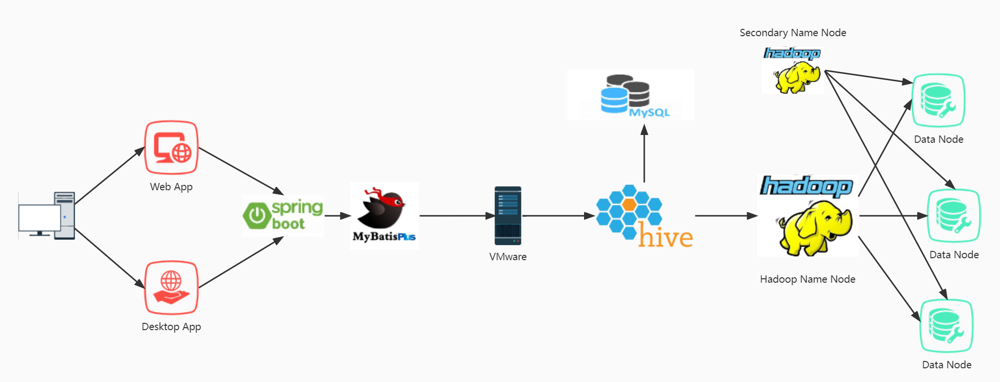
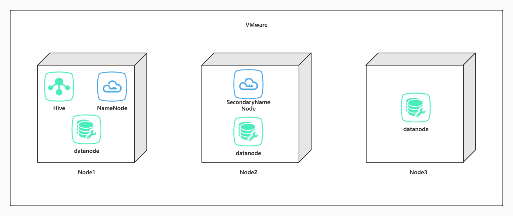
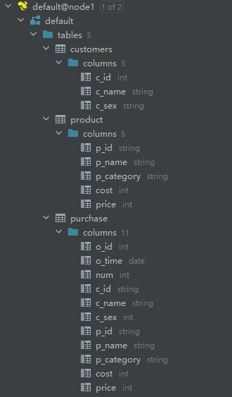
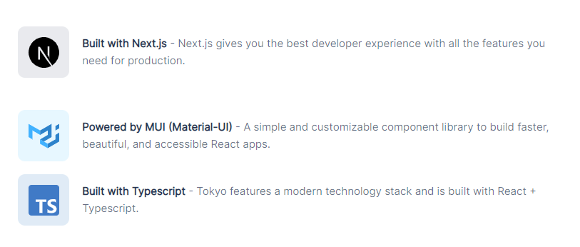
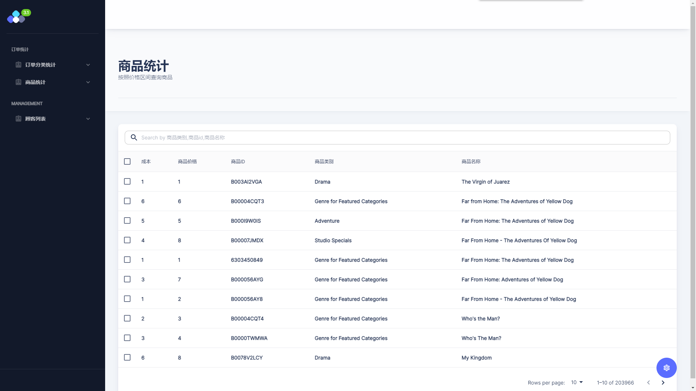
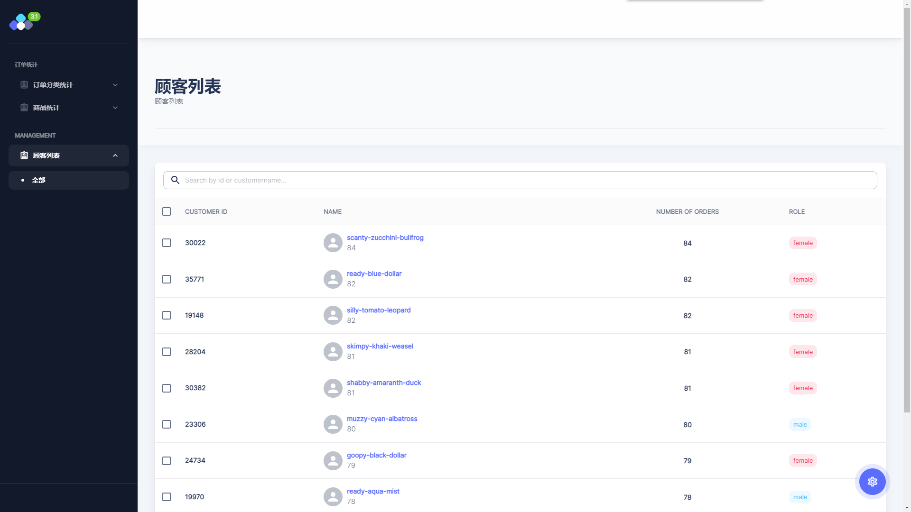
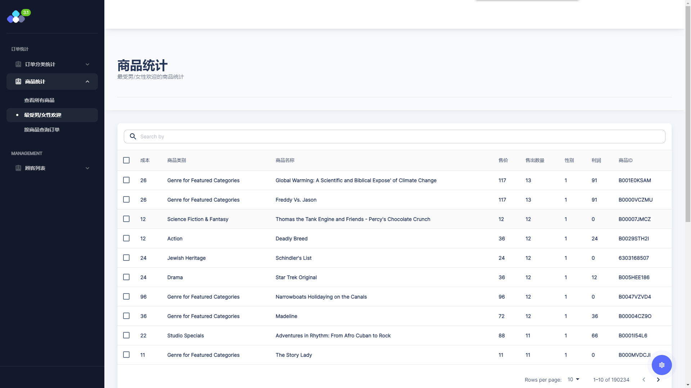
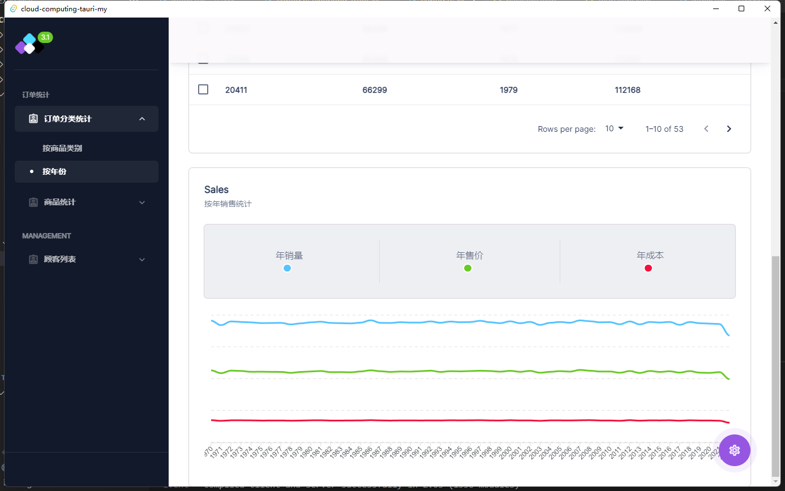
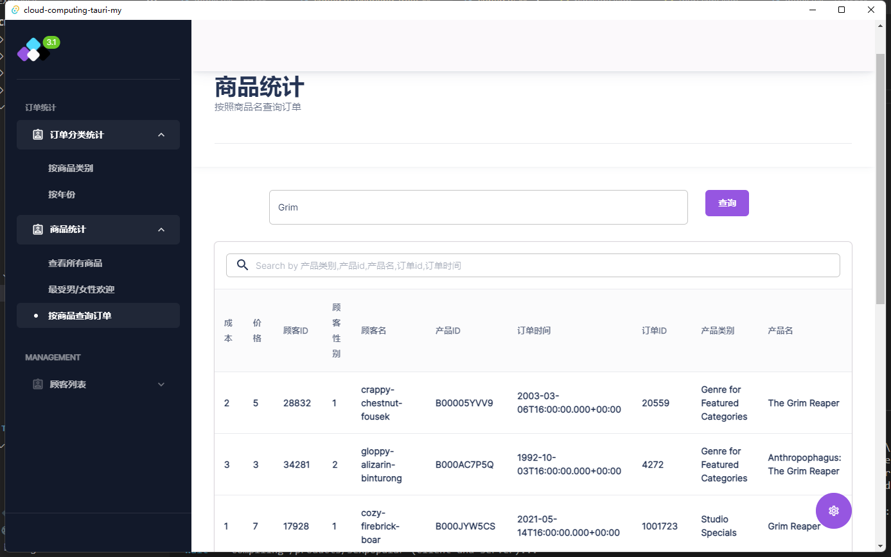
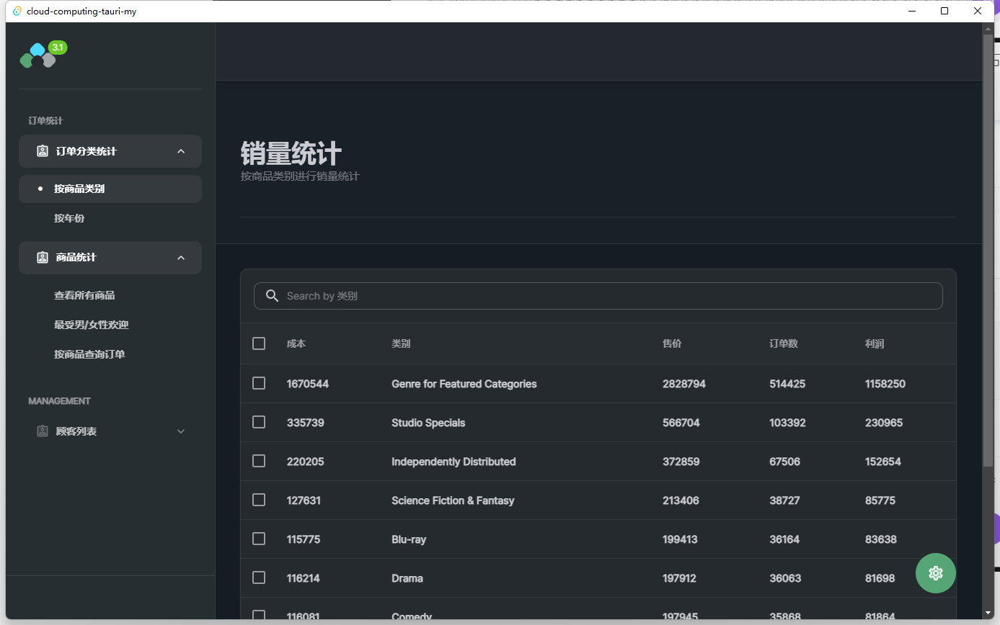

# 2022秋 云计算技术 课程项目

> 学号：1951477
>
> 姓名：孟宇
>
> github 仓库地址（暂为 private 状态，将在第 17 周课程答辩结束后开源）：


## 项目简介

​	设计和实现一个由多个节点组成的云服务系统，并提供云系统中的存储服务功能。

1. 通过 Hadoop 平台搭建云系统，有两种架构方式（两者选其一完成即可）。
2.  云系统的节点数量不少于 4 个。 
3.  云系统拥有基本的分布式存储功能，包括: 
   1. 文件的上传与下载。从任意一个节点都能上传文件到系统中，也能从任意一个节点访问并下载系统中的每个文件。 
   2.  文件的分块与备份。系统对大容量文件以分块的形式存储，并且系统中存储的每个文件都有多个副本，当系统中不超过 20% 的节点失效时，也不影响 系统中所有文件的访问。
   3.  文件的一致性。从任意一个节点访问并更新某个文件后，其在系统中的副本也相应进行更新。 
4. 基于搭建好的 Hadoop 安装 Hive，并在 Hive 上创建数据库，然后为一个销售系统的销售模块创建库和表（需自行设计表结构，并构造一些模拟数据填充进去，以便可以用来做查询分析）。


## 整体架构

本项目的整体架构图如下



​	我使用了简单的前端 + 后端 + 存储的三层架构，前端实现了网页应用和桌面应用的双端访问，通过 http 请求访问后端，后端使用 Java 采用 Spring boot 框架通过 MyBatisPlus 和 hive-jdbc 访问存储架构。存储方面，在本地使用 VMware 虚拟机，利用 Hadoop 搭建 HDFS 分布式文件系统作为底层存储，物理上底层包含共 3 个结点，逻辑上分为 1 个 Name Node，1 个 Secondary Name Node 以及 3 个 Data Node 。并在 Hadoop 上部署 Hive ，使用 MySQL 关系型数据库作为 Hive 的 Metastore 服务，将 HDFS 上的数据文件映射为结构化的关系型数据库字段。Hive 解析来自 jdbc 的 HQL 查询语句并编译为 Map Reduce 程序，查询结果并返回 Response 到前端进行渲染。


### 1. 存储架构

​	存储架构方面，因为本学期的项目受不能组队，考虑到需要使后续单人开发难度可控，我选择了搭建较为简单的单个 name node 架构。在一台服务主机上虚拟出物理上的 3 个结点，逻辑上则分为 1 个 name node， 1 个 secondary name node，以及 3 个 data node。由于在 Docker 中虚拟 3 个 Data Node 常态下就需要约 6 GB 以上的内存，而进行数据查询还需要执行 Map Reduce 程序，16 GB 以下的云服务器比较难以负担这样的负载，而作为个人项目我也很难负担多个云服务器进行完全分布式存储，因此我选择在本地使用虚拟机进行伪分布式系统的搭建。




#### 表设计

​	本项目中，通过 Hive 映射，共建立了 3 张数据表，分别为 `customers`，`products` 和 `purchase`，与项目题目中所要求的销售系统模拟数据相对应。表的设计与建表脚本如下：

​		数据表进行了去范式化的设计，因为分布式数仓解决的问题要点是大数据量下的存储和查询效率，而不是频繁的增删改，因此数据表的设计并不符合第三范式的要求。结合应用场景分析，为方便后端查询，存储系统建立了宽表，有一定的数据冗余，但能够提高查询效率。

1. 商品表的设计 `product`

| 商品id（p_id） | 产品名称（p_name） | 产品分类（p_category） | 产品成本（cost） | 产品售价（price） |
| -------------- | ------------------ | ---------------------- | ---------------- | ----------------- |
| string         | string             | string                 | int              | int               |

```sql
create table product(
    p_id       string comment 'productId',
    p_name     string comment 'productName',
    p_category string comment 'productCategory',
    cost       int comment 'cost',
    price      int comment 'price'
)
row format delimited fields terminated by ',' 
STORED AS TEXTFILE;
```


2. 顾客表的设计 `customers`

| 顾客id（c_id） | 顾客姓名（c_name） | 顾客性别（c_sex） |
| -------------- | ------------------ | ----------------- |
| int            | string             | string            |

```sql
create table customers(
    c_id   int comment 'userId',
    c_name string comment 'username',
    c_sex  string comment 'gender'
)
row format delimited fields terminated by ',' 
STORED AS TEXTFILE;
```


3. 订单表的设计 `purchase`

| 订单id（o_id） | 订单时间（o_time） | 商品数（num） | 买家id（c_id） | 买家名字（c_name） | 买家性别（c_sex） | 商品id（p_id） | 商品名称（p_name） | 商品类别（p_category） | 商品成本（cost） | 商品售价（price） |
| -------------- | ------------------ | ------------- | -------------- | ------------------ | ----------------- | -------------- | ------------------ | ---------------------- | ---------------- | ----------------- |
| int            | date               | int           | int            | string             | string            | string         | string             | string                 | int              | int               |

```sql
create table purchase
(
    o_id       int comment 'orderid',
    o_time     date comment 'ordertime',
    num        int comment 'ordernumber',
    c_id       string comment 'customerid',
    c_name     string comment 'customername',
    c_sex      int comment 'customersex',
    p_id       string comment 'productid',
    p_name     string comment 'productname',
    p_category string comment 'productcat',
    cost       int comment 'cost',
    price      int comment 'price'
)
row format delimited fields terminated by ',' 
STORED AS TEXTFILE;
```


#### 模拟数据插入

​	数据表中使用 Python 进行随机的数据插入，数据量级如下：

​		customers 表：20000+

​		product 表： 200000+

​		purchase 表：1000000+

​	模拟数据的生成脚本附带在项目文件中。




### 后端

​	后端搭建采用了经典的 Java 语言 Springboot 框架进行快速开发，通过 hive-jdbc 与分布式存储系统通信并进行查询。基于去范式化的数据库设计，查询方面将不会涉及到大量的多表级联聚合统计，因此 ORM 框架方面选择 MyBatis-Plus ，使得单表查询的实现更简单轻便。


### 前端

​	前端方面，选择了基于 typescript 和 rust 语言的技术栈，实现了一套同时适配浏览器访问的 web app 与跨平台桌面访问的 desktop app。通过 react.js 、 next.js 搭配 material UI 组件库进行 web 前端的开发，使用基于 rust 的 tauri 框架实现由了 web 端向桌面端的迁移。




## 系统查询功能

系统支持了几条简单的查询与数据统计功能，如下所示：

1. 顾客列表及购买量统计

查询模拟系统中的所有顾客数据，能够统计每名顾客的购买量，并按降序排序。

```java
    public List<Map<String, Object>> getBestCustomers() {
        QueryWrapper<Order> wrapper = new QueryWrapper<>();
        wrapper.select(
                "c_id, c_name, c_sex, count(*) as count"
        );
        wrapper.isNotNull("c_id");
        wrapper.isNotNull("c_name");
        wrapper.isNotNull("c_sex");
        wrapper.groupBy("c_id, c_name, c_sex");
        wrapper.orderByDesc("count");
        return this.orderMapper.selectMaps(wrapper);
    }
```


2. 按照商品类别进行销量统计

筛选所有商品的类别，按照类别统计总销量，并按销量降序排序。

```java
    public List<Map<String, Object>> getOrderStatisticsByProductCategory() {
        QueryWrapper<Order> wrapper = new QueryWrapper<>();
        wrapper.select(
                "p_category, count(*) as count, sum(cost) as cost, sum(price) as price, sum(price) - sum(cost) as profit"
        );
        wrapper.isNotNull("p_category");
        wrapper.isNotNull("price");
        wrapper.isNotNull("cost");
        wrapper.groupBy("p_category");
        wrapper.orderByDesc("count");
        return this.orderMapper.selectMaps(wrapper);
    }
```


3. 按照年份进行销量统计

筛选所有订单的时间，按照年份统计总销量，并按销量降序排序

```java
    public List<Map<String, Object>> getYearlyOrderStatistics() {
        QueryWrapper<Order> wrapper = new QueryWrapper<>();
        wrapper.select(
                "count(*) as volume, sum(cost) as cost, sum(price) as price, year(o_time) as year"
        );
        wrapper.groupBy("year(o_time)");
        wrapper.having("year is not null");
        return this.orderMapper.selectMaps(wrapper);
    }
```


4. 查询商品，并按各种条件进行筛选

```java
    public List<Product> getProductByPriceRange(Integer low, Integer high) {
        QueryWrapper<Product> wrapper = new QueryWrapper<>();
        wrapper.between("price", low, high);
        return this.productMapper.selectList(wrapper);
    }
```


5. 查询最受男/女性顾客欢迎的商品

按顾客性别对订单进行分类，按销量降序排序。

```java
    public List<Map<String, Object>> getOrderStatisticsBySex(String sex) {
        QueryWrapper<Order> wrapper = new QueryWrapper<>();
        wrapper.select(
                "c_sex, p_id, p_name, p_category, count(*) as count, sum(cost) as cost, sum(price) as price, sum(price) - sum(cost) as profit"
        );
        wrapper.isNotNull("purchase.cost");
        wrapper.isNotNull("purchase.price");
        wrapper.isNotNull("purchase.p_id");
        wrapper.isNotNull("p_name");
        wrapper.isNotNull("p_category");
        wrapper.groupBy("c_sex, p_id, p_name, p_category");
        wrapper.having("c_sex ='" + sex + "'");
        wrapper.orderByDesc("count");
        return this.orderMapper.selectMaps(wrapper);
    }
```


6. 根据商品名称筛选订单

```java
    public List<Order> getOrdersByProductName(String productName) {
        QueryWrapper<Order> wrapper = new QueryWrapper<>();
        wrapper.like("p_name", productName);
        wrapper.isNotNull("o_id");
        wrapper.isNotNull("p_id");
        wrapper.isNotNull("p_name");
        wrapper.isNotNull("p_category");
        return this.orderMapper.selectList(wrapper);
    }
```


## 页面展示

Web 端 App 示例：








Desktop App 示例：





